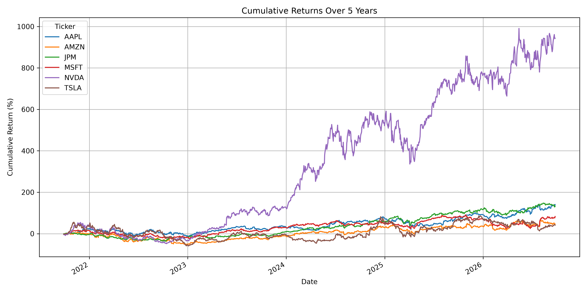
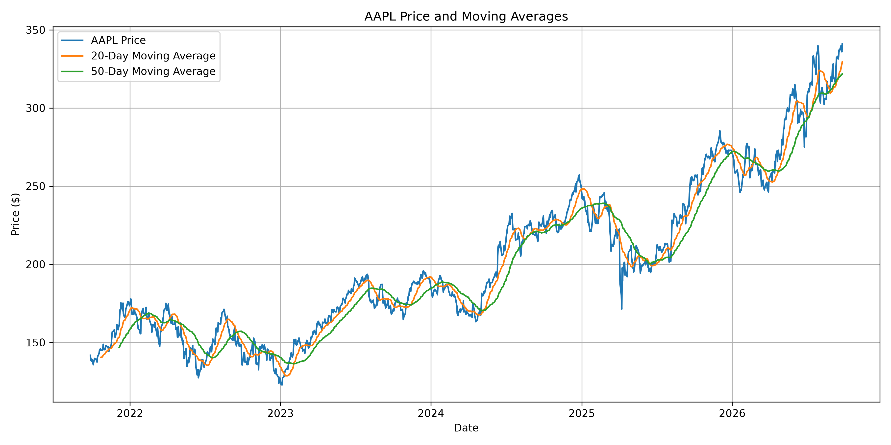
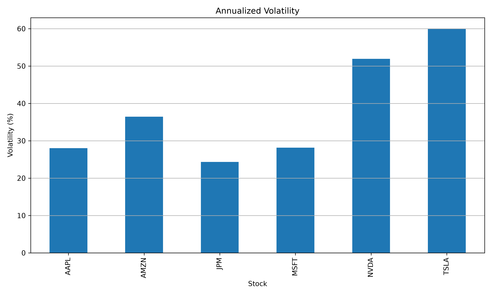
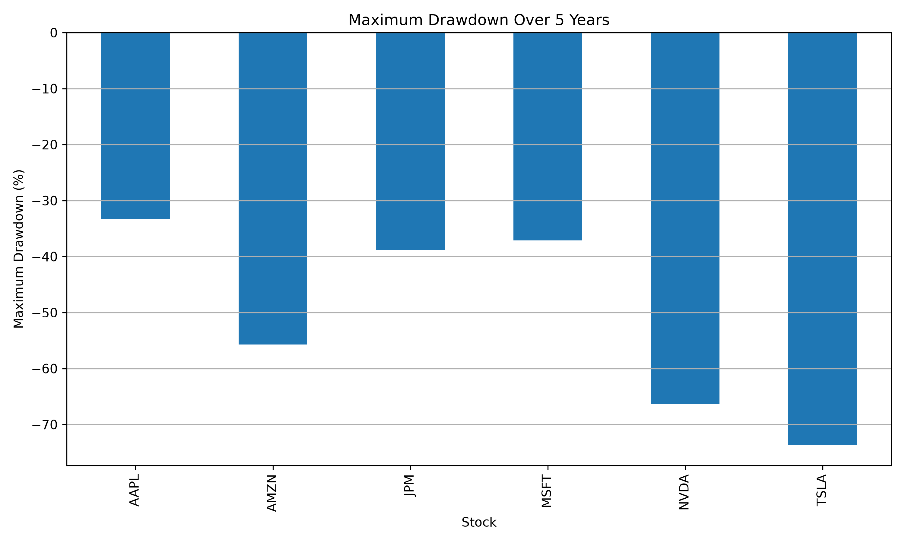
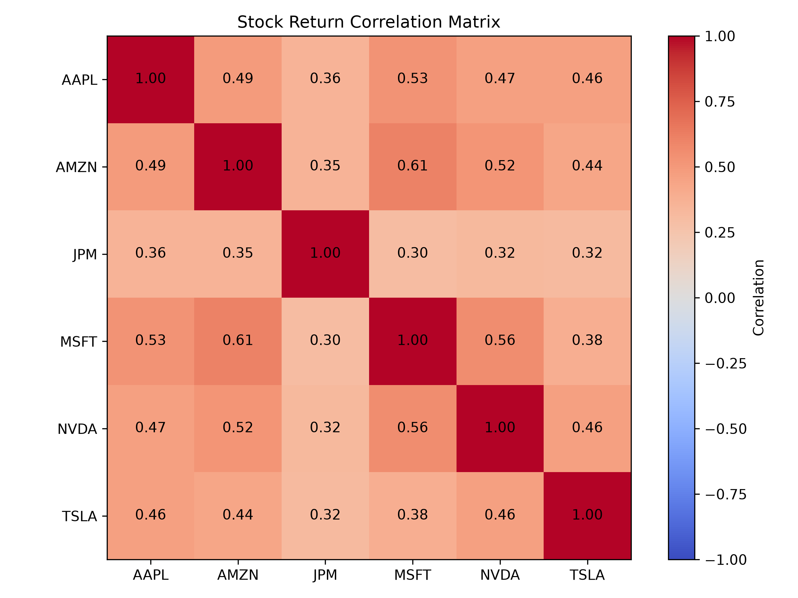
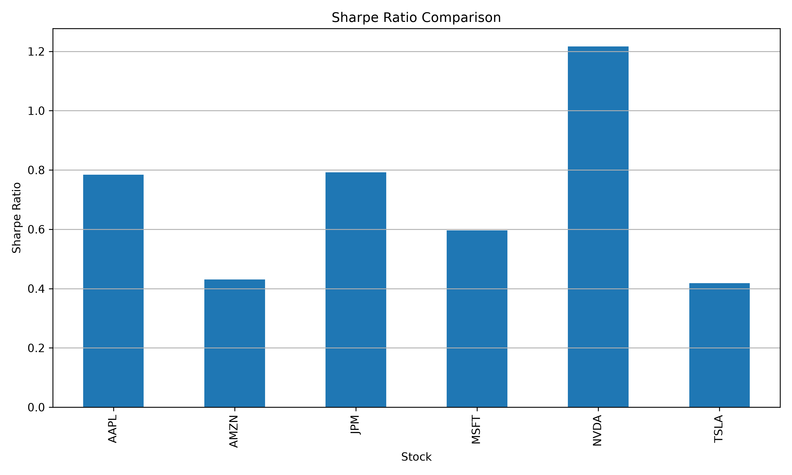

# Stock Market Data Explorer

A Python-based exploratory analysis of historical stock market data for six major US companies:

- Apple (AAPL)
- Amazon (AMZN)
- JPMorgan Chase (JPM)
- Microsoft (MSFT)
- Nvidia (NVDA)
- Tesla (TSLA)

The project analyzes five years of daily market data using Python, Pandas, yfinance, and Matplotlib.

## Project Goals

The objective of this project was to build a foundation in financial data analysis by exploring:

- historical stock prices
- daily returns
- cumulative returns
- moving averages
- volatility
- maximum drawdown
- stock correlations
- Sharpe ratios
- best and worst trading days

No machine learning is used in this project. The focus is on understanding financial data and the statistical concepts underlying quantitative analysis.

---

## Data

Historical daily market data is downloaded using the `yfinance` Python package.

The analysis uses approximately five years of daily data with adjusted prices to account for corporate actions such as stock splits and dividends.

---

## Cumulative Returns

Cumulative return measures the total compounded return of an investment from the beginning of the analysis period.



Over the sample period, Nvidia generated substantially higher cumulative returns than the other stocks, although this was accompanied by significantly higher risk.

---

## Moving Averages

20-day and 50-day moving averages were calculated for Apple to smooth short-term price fluctuations and identify longer-term price trends.



The 20-day moving average responds more quickly to price changes, while the 50-day moving average produces a smoother and slower-moving trend.

---

## Volatility

Volatility is calculated using the standard deviation of daily returns and annualized using approximately 252 trading days per year.



Tesla and Nvidia showed substantially higher historical volatility than the other stocks in the dataset, while JPMorgan exhibited the lowest volatility.

---

## Maximum Drawdown

Maximum drawdown measures the largest peak-to-trough decline experienced by a stock during the analysis period.



Tesla experienced the deepest drawdown in the sample, losing more than 70% from a previous peak at its worst point.

---

## Correlation

Correlation measures how closely the daily returns of different stocks move together.



The analysis shows positive correlations across the stocks, although the strength of these relationships differs. This demonstrates why simply owning multiple stocks does not necessarily provide full diversification.

---

## Sharpe Ratio

The Sharpe ratio compares return with volatility and provides a simple measure of risk-adjusted performance.

For this introductory analysis, the risk-free rate is assumed to be zero.



---

## Best and Worst Trading Days

The project also identifies the largest single-day gain and loss for every stock in the dataset.

This helps highlight extreme market movements that may not be obvious from average volatility alone.

---

## Technologies Used

- Python
- Pandas
- Matplotlib
- yfinance
- Git
- GitHub

---

## Running the Project

Clone the repository:

```bash
git clone YOUR_REPOSITORY_URL
cd stock-market-data-explorer